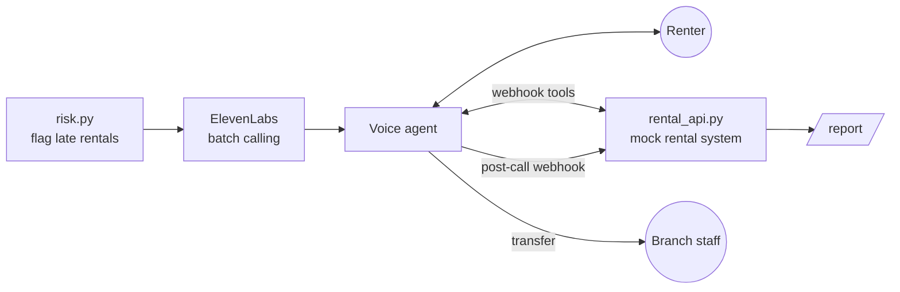

# Late-return voice agent (ElevenLabs)

A rental car that won't make it back on time can strand the next customer. This demo finds those rentals and calls the renter with an [ElevenAgents](https://elevenlabs.io/docs/eleven-agents/overview) voice agent that sells an extension or secures a new return time, then reports the result to fleet ops.

All data is fictional (Northwind Rentals, 555 numbers).

## Why it matters
The car is late either way; the call turns a surprise into a plan. The main value is warning time: reassigning the next customer's car hours ahead is far cheaper than at the counter. Extension revenue helps, but it has to be net of late fees you'd bill anyway and of the new conflicts extensions create.

Illustrative, per 100 late rentals:

| Outcome of the Agent Call | Assumption | Impact |
|---|---|---|
| Gain: next customer's car arranged in advance | 20 of 100 late cars are booked by another customer next. The agent reaches the current renter in 12 of those cases, so staff can assign the next customer a different car hours ahead (about $30) instead of at the counter (about $150: free upgrade, voucher, staff time) | 12 × ($150 − $30) = +$1,440 |
| Gain: paid extensions | 30 renters extend one day at $75 | 30 × $75 = +$2,250 |
| Offset: late fees you'd have charged anyway | Approx half of these renters would have brought the car back late regardless and paid a late fee, so not all extension revenue is new money. | 15 × $75 = −$1,125 |
| Cost: new conflicts extensions create | 5 extensions run into a next booking, reassigned with notice at about $30 | 5 × $30 = −$150 |
| Cost: running the calls | 100 calls, 2 min each, $0.10 per minute | 100 × 2 × $0.10 = −$20 |
| **Net** | | **$1,440 + $2,250 − $1,125 − $150 − $20 = +$2,395** |



## How it works
1. **Detect.** `risk.py` estimates drive time from GPS distance and flags rentals that will be late, ranking ones that block another customer's booking first.
2. **Call.** `calls.py` sends them to the batch calling API with per-renter variables, within 8am–9pm local time (demo mode skips this).
3. **Converse.** The agent verifies identity, quotes and applies extensions, or logs a return ETA through tools on `rental_api.py`. Accidents, theft, disputes or "get me a person" transfer to staff.
4. **Report.** The post-call webhook stores structured outcomes; `/report` shows extensions sold, revenue added, escalations and bookings to reassign.

## Design choices
- **Verify before disclosing.** No rental details until the billing ZIP matches, enforced by the server per conversation and reservation (not just the prompt). Three wrong ZIPs lock the reservation.
- **No payment data by voice.** Extensions charge the card on file.
- **Prices come only from the tool.** Extensions are capped at 7 days; an eval checks the agent never invents a discount.
- **Disclosure.** The first line says it's an AI and the call may be recorded; voicemails carry no rental details. See ElevenLabs' [TCPA](https://elevenlabs.io/docs/eleven-agents/legal/tcpa) and [disclosure](https://elevenlabs.io/docs/eleven-agents/legal/disclosure-requirement) notes.
- **Signed webhooks.** HMAC-verified with a 30-minute window; only post-call transcripts are stored.
- **Agent as code.** `agent.py` creates or updates the agent, tools and secret; `prompt.md` is the prompt.

## Run it
Needs an ElevenLabs account with a Twilio number imported, Python 3.11+, and [ngrok](https://ngrok.com).

```bash
pip install -r requirements.txt
cp .env.example .env              # fill in values as you go
ngrok http 8000                   # terminal 2: https URL -> PUBLIC_URL
# ElevenLabs settings: post-call webhook -> <PUBLIC_URL>/webhooks/elevenlabs, its secret -> WEBHOOK_SECRET
python rental_api.py              # terminal 1
python agent.py                   # create/update the agent
python evals.py                   # simulated-caller tests (resets demo data)
python calls.py                   # dry run: shows who would be called
python calls.py --send            # rings DEMO_PHONE as the top at-risk renter
# Report: <PUBLIC_URL>/report?key=<REPORT_KEY>
```
Offline tests: `python test_local.py`.

## Evals
| Scenario | Passes when |
|---|---|
| accepts_extension | verifies, quotes from tool, extends |
| wrong_person | reveals nothing, no extension |
| spanish_speaker | stays in Spanish, logs ETA |
| accident | checks safety, transfers, no selling |
| wants_discount | no discount or invented price |

## Production gaps
In-memory state, a straight-line drive-time model, and a mock rental system. A ZIP code alone is a weak identity check. A real deployment would use the rental system's API and telematics, a durable store, stronger verification (e.g. an SMS code), consent records, and do-not-call checks.
